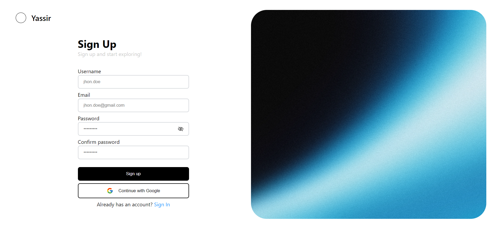
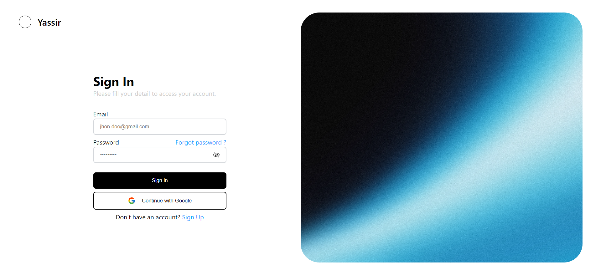
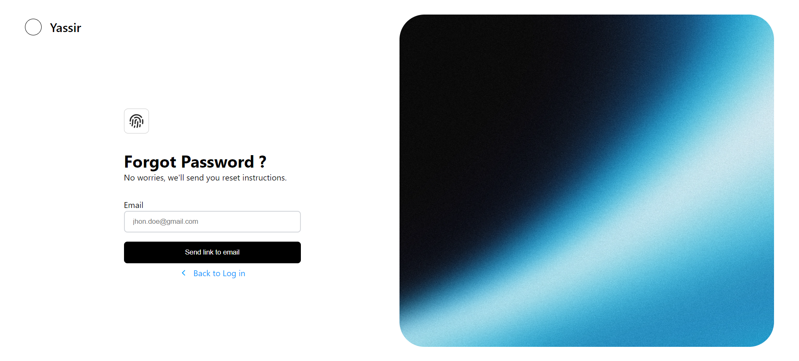
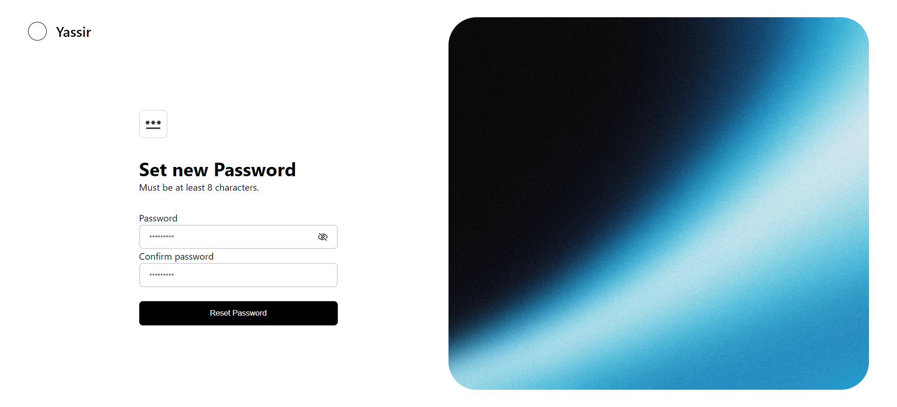
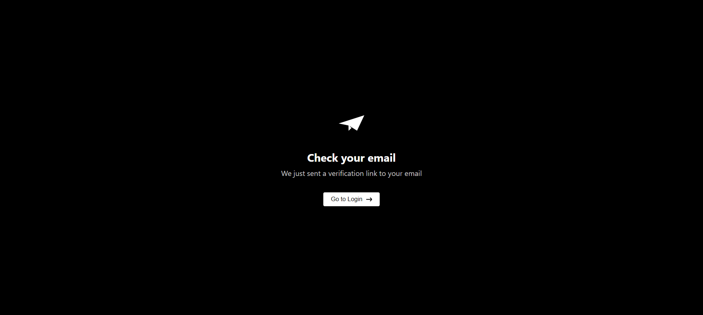

## Full Stack User Authentication System 🔐

This project is a comprehensive user authentication system designed to handle various aspects of user authentication, including registration, login, logout, email verification, password reset, and Google authentication. The system is built using modern technologies and follows best practices for security and scalability.

### Features ✨

* **Email/Password Authentication:**
    * User registration with email verification.
    * Secure login and logout functionality.
    * Password reset and recovery mechanisms.
* **Google OAuth Integration:**
    * Seamless login using Google accounts.
* **User Management:**
    * Account verification via email.
    * Token-based authentication for secure API access.
    * Refresh token mechanism for extended session duration.

### Technology Stack 🚀

* **Backend:**
    * **Node.js**  [https://nodejs.org/](https://nodejs.org/) 
    * **Express.js** [https://expressjs.com/](https://expressjs.com/) 
    * **MongoDB**  [https://www.mongodb.com/](https://www.mongodb.com/) 
    * **JWT (JSON Web Tokens)** [https://jwt.io/](https://jwt.io/)
* **Frontend:**
    * **React**  [https://reactjs.org/](https://reactjs.org/) 
* **Other:**
    * **Docker** for containerization [https://www.docker.com/](https://www.docker.com/)
    * **Docker Compose** for multi-container orchestration [https://docs.docker.com/compose/](https://docs.docker.com/compose/)
    * **Husky** for Git hooks (pre-commit) [https://typicode.github.io/husky/](https://typicode.github.io/husky/)

### Object-Oriented Design & Dependency Injection
* **Object-Oriented Programming (OOP):**
   * The backend leverages OOP principles to create modular, reusable, and maintainable code.

* **Inversify Library:**
   *  Used for Dependency Injection (DI) to manage the dependencies between classes, promoting loose coupling and making the application easier to test and extend.
  
## Screenshots

|  |  |
|---|---|
|Sign Up page|Sign In page|
|  |  |
|Forgot password page|Reset password page|
|  |  |
|Email verification page|Dashboard page|
|  |  |

### Project Structure 📁

```
├── server
│   ├── src
│   │   ├── controllers
│   │   │   └── auth
│   │   ├── core
│   │   │   ├── config
│   │   │   └── interfaces
│   │   ├── middlewares
│   │   ├── models
│   │   ├── repositories
│   │   ├── routes
│   │   │   └── auth
│   │   ├── services
│   │   │   └── auth
│   │   ├── utils
│   │   └── validator
│   │   ├── .env.template
│   └── ...
│
├── client
│   ├── src
│   └── ...
│
├── docker-compose.yml
└── README.md
```

### Running and Configuring the Application 🏃‍♂️

#### 1. Environment Variables 🔐

Create a `.env` file by copying the `.env.template` file and filling in the following environment variables:

```
PORT=
API_PREFIX=
MONGODB_URI=

SERVER_URL=
CLIENT_URL=

AUTH_ACCESS_TOKEN_SECRET=
AUTH_ACCESS_TOKEN_EXPIRY=

AUTH_REFRESH_TOKEN_SECRET=
AUTH_REFRESH_TOKEN_EXPIRY=

EMAIL_TOKEN_SECRET=
EMAIL_TOKEN_EXPIRY=

AUTH_EMAIL_USER=
AUTH_EMAIL_PASS=

GOOGLE_CLIENT_ID=
GOOGLE_CLIENT_SECRET=
GOOGLE_REDIRECT_URI=
```

<details>
  <summary>Explanation</summary>
  <p>

* **PORT:** Port on which the server will listen.
* **API_PREFIX:** Prefix for all API endpoints.
* **MONGODB_URI:** MongoDB connection URI.
* **AUTH_ACCESS_TOKEN_SECRET:** Secret key for generating access tokens.
* **AUTH_ACCESS_TOKEN_EXPIRY:** Expiry time for access tokens.
* **AUTH_REFRESH_TOKEN_SECRET:** Secret key for generating refresh tokens.
* **AUTH_REFRESH_TOKEN_EXPIRY:** Expiry time for refresh tokens.
* **EMAIL_TOKEN_SECRET:** Secret key for generating email verification tokens.
* **EMAIL_TOKEN_EXPIRY:** Expiry time for email verification tokens.
* **AUTH_EMAIL_USER:** Email address for sending verification emails.
* **AUTH_EMAIL_PASS:** Password for the email account.
* **GOOGLE_CLIENT_ID:** Google OAuth Client ID.
* **GOOGLE_CLIENT_SECRET:** Google OAuth Client Secret.
* **GOOGLE_REDIRECT_URI:** Google OAuth Redirect URI.

  </p>
</details>

#### 2. Setting up Google OAuth 

* **Create a Google Cloud Project:**  
    * Go to the Google Cloud Console [https://console.cloud.google.com/](https://console.cloud.google.com/).
    * Create a new project.
* **Enable the Google Sign-In API:**
    * Go to the "APIs & Services" section of your project.
    * Search for "Google Sign-In" and enable it.
* **Create OAuth 2.0 credentials:**
    * Go to the "APIs & Services" -> "Credentials" section.
    * Click "Create credentials" -> "OAuth client ID".
    * Choose "Web application" as the application type.
    * In the "Authorized redirect URIs" field, add `http://localhost:3000/auth/google/callback` (or your appropriate redirect URI).
    * Click "Create" to generate your client ID and client secret.
* **Update your `.env` file:**
    * Fill in the `GOOGLE_CLIENT_ID`, `GOOGLE_CLIENT_SECRET`, and `GOOGLE_REDIRECT_URI` environment variables with the values you obtained from Google Cloud Console.


#### 3. Installation and Running 

1. **Prerequisites:**
   * **Node** (look at .nvmrc file for version)
   * **Docker and Docker Compose** installed.
   * **Node.js and npm** installed.

3. **Clone the repository:**
   ```bash
   git clone https://github.com/ramo4040/FullStack-User-Authentication-System-TS-React-Express-MongoDB.git
   ```
4. **Navigate to the project directory:**
   ```bash
   cd FullStack-User-Authentication-System-TS-React-Express-MongoDB
   ```
5. **Install dependencies:**
   ```bash
   npm install 
   ```
6. **Start the containers:**
   ```bash
   docker-compose up --build -d
   ```
   This will build the Docker images if they don't exist and then run them in detached mode.
7. **Access the application:**
   Open your browser and navigate to `http://localhost:3000` (or the port specified in your `.env` file).


**Remember to:**

*  **Keep your secrets secure!**  Do not commit your `.env` file to version control. 
*  **Configure your email provider** and set up your email credentials correctly.
*  **Test thoroughly** to ensure all features, including email verification and Google authentication, are working correctly.

Let me know if you have any questions or if there's anything else I can help you with! 


## API Reference

#### Register User

```http
  POST /api/v1/auth/register
```

| Parameter | Type     | Description                |
| :-------- | :------- | :------------------------- |
| `Username` | `string` | **Required**. User username |
| `Email` | `string` | **Required**. User email |
| `Password` | `string` | **Required**. User password |
| `Confirm password` | `string` | **Required**. User password |

#### Login User

```http
  POST /api/v1/auth/login
```

| Parameter | Type     | Description                       |
| :-------- | :------- | :-------------------------------- |
| `email`      | `string` | **Required**. User email |
| `password`      | `string` | **Required**. User password |

#### Logout User

```http
  GET /api/v1/auth/logout
```

#### Google OAuth Authentication

```http
  GET /api/v1/auth//google/authenticate
```

#### Google OAuth Callback

```http
  GET /api/v1/auth/google/callback
```
| Parameter | Type     | Description                       |
| :-------- | :------- | :-------------------------------- |
| `code`      | `query(url)` | callback code |

#### Verify Email

```http
  GET /api/v1/auth//verify-email
```
| Parameter | Type     | Description                       |
| :-------- | :------- | :-------------------------------- |
| `token`      | `query(url)` | token generated for email validation|
| `oldAccessToken`      | `cookies` | old access token |

#### Refresh Token

```http
  POST /api/v1/auth/token/refresh
```
| Parameter | Type     | Description                       |
| :-------- | :------- | :-------------------------------- |
| `refreshToken`      | `cookie(string)` | Required. Refresh token |

#### Forgot password 

```http
  POST /api/v1/auth/forgot-password
```
| Parameter | Type     | Description                       |
| :-------- | :------- | :-------------------------------- |
| `email`      | `string` | Required. User email |

#### Validate Reset Token 

```http
  GET /api/v1/auth/validate-reset-token
```
| Parameter | Type     | Description                       |
| :-------- | :------- | :-------------------------------- |
| `token`      | `query(url)` | Required. Reset token |

#### Reset Password 

```http
  PUT /api/v1/auth/reset-password
```
| Parameter | Type     | Description                       |
| :-------- | :------- | :-------------------------------- |
| `token`      | `query(url)` | Required. Reset token |
| `email`      | `string` | Required. New password |

#### Get current user 

```http
  GET /api/v1/auth/me
```


**Notes:**

* All endpoints require authentication except for `/api/auth/register`, `/api/auth/login`, `/api/auth/forgot-password`, `/api/auth/validate-reset-token`, and `/api/auth/google/authenticate`.
* All endpoints return JSON data.
* The `token` in the request body or query parameter should be a valid authentication or verification token.
* The response body may contain additional information depending on the specific endpoint.


### Contributing 🙌

Contributions are welcome! Please fork the repository, make your changes, and submit a pull request.

### License 📝

This project is licensed under the MIT License.
